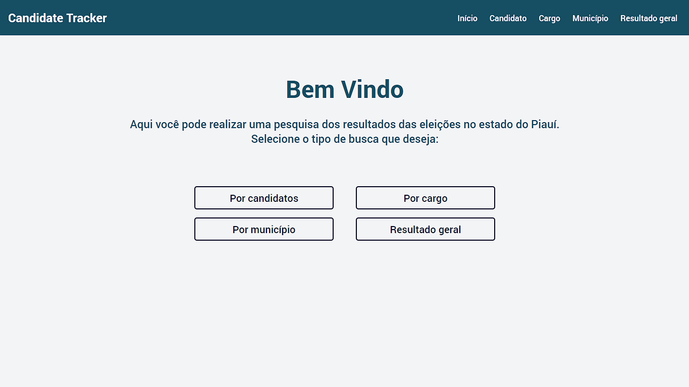

# PROG3-AVAL2
Segunda avaliação de PROG 3

UNIVERSIDADE ESTADUAL DO PIAUÍ – UESPI

CURSO DE BACHARELADO EM COMPUTAÇÃO

DISCIPLINA: PROGRAMAÇÃO III

PROFESSOR: EYDER RIOS

GRUPO: BRENO VASCONCELOS, DYMAS SOUSA, HERON NEPOMUCENO

> Candidate Tracker

O projeto foi feito no intuito de criar uma página de pesquisa de resultados das eleições no estado do Piauí. Nele pode ser feita uma pesquisa por nome de candidato, cargo, municipio e visualizar o resultado geral da votação no Estado para todos os cargos eletivos.